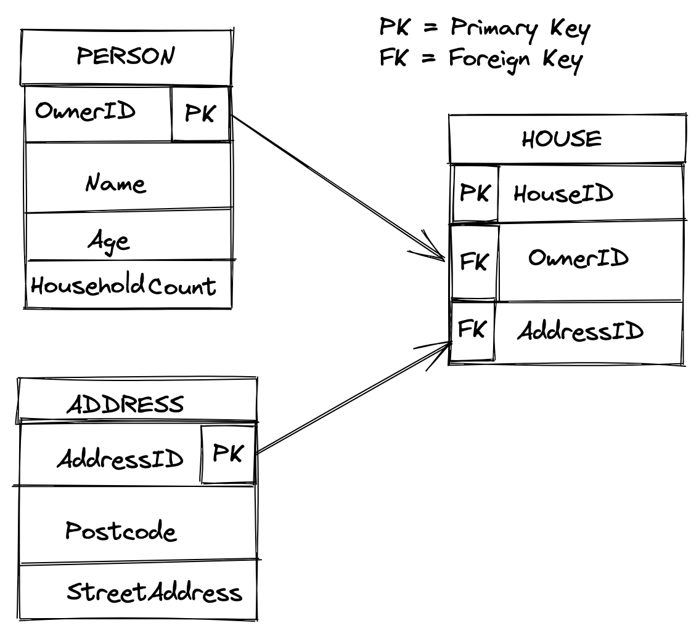

# Neighbour Finder
Neighbourhood Collaboration Site

1. Consider the type of data we will be storing and therefore the type of database we should implement (SQL vs NoSQL)

   SQL as many relationships between them so makes more sense

2. Create a schema for this database

   - Each person has a name, age and number of people in their household

   - Each house has an address and an owner

   - Each address has a postcode and street address  
   

   
   

3. Consider the requests our API should be capable of handling

   **Store people, houses and addresses:**

   POST /houses/:ID  /houses/:ID/address  /houses/:ID/owner

   **Look up a house, its address and owner:**		

   GET /houses/:ID  /houses/:ID/address  /houses/:ID/owner

   **Look up people in our neighbourhood within certain age brackets and with specific household sizes:**		

   GET /houses/:params		

   Example: /houses?lowerAge=18&upperAge=40&householdCount=3

4. List the routes you will need with their HTTP verb and path

5. Determine the responses that should be returned and the content types of these requests and responses

   ### List All Houses [GET]

   \+ Response 200 (application/json)
       [      {        "houseID": 1,        "addressID": 1,        "ownerID": 3,      }, {        "houseID": 2,        "addressID": 2,        "ownerID": 2,      }    ]

   \### Create a House [POST]

   You may create your own house using this action. It takes a JSONobject containing addressID and a ownerID in theform of choices.

   \+ Request (application/json)
       {      "houseID": Automatically generated,      "addressID": 4,      "ownerID": 7,    }

   \+ Response 201 (application/json)

     \+ Headers
         Location: /houses	  + Body
         {        "houseID": 1,        "addressID": 1,        "ownerID": 3,      }, {        "houseID": 2,        "addressID": 2,        "ownerID": 2,      }, {      "houseID": 3      "addressID": 4,      "ownerID": 7,       }    ]

 
